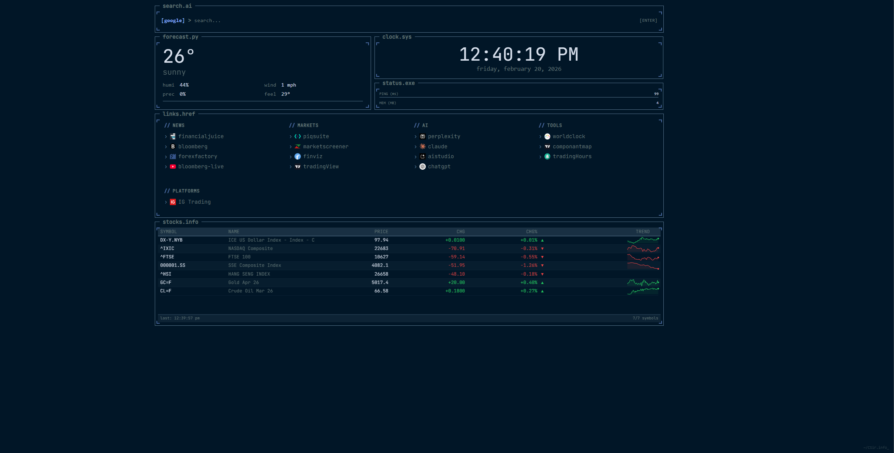
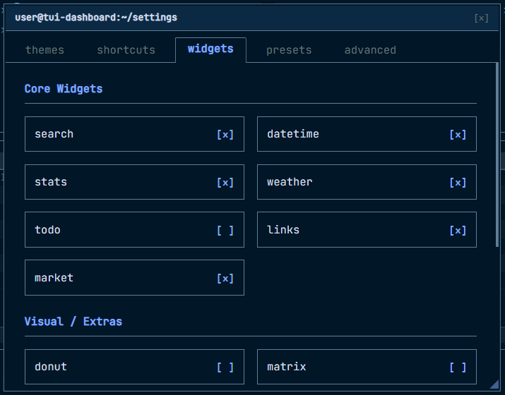

<p align="center">
  
</p>

<h1 align="center">PixelDash</h1>

<p align="center">
  A retro-inspired, pixel art new tab dashboard with weather widgets, LED clock, and productivity tools.
</p>

<p align="center">
  <strong>Based on:</strong> <a href="https://github.com/thecsir/TerminalStart">TerminalStart</a> by DevCSir
</p>

<p align="center">
  
</p>

<p align="center">
  
</p>

---


## Install in Edge / Chrome

1. Open `edge://extensions` (or `chrome://extensions`)
2. Enable **Developer Mode**
3. Click **Load unpacked**
4. Select the `extension` folder


## Todoist Integration

Sync your todo widget with Todoist using a personal API token.

1. Go to **Settings > Advanced > Todo Widget**
2. Enable **Sync with Todoist**
3. Paste your API token (Settings > Integrations > Developer on [todoist.com](https://todoist.com))
4. Grant host permission when prompted

**Due dates** &mdash; add natural language dates when creating tasks:

| Input | Task | Due |
|---|---|---|
| `meet john tomorrow at 2pm` | meet john | tomorrow at 2pm |
| `buy groceries next monday` | buy groceries | next monday |
| `call mom every friday` | call mom | every friday |
| `submit report jan 15` | submit report | jan 15 |

Todoist's NLP handles parsing. Local mode still supports time-only syntax (e.g. `standup 9am`).

## Build

### Requirements

* Node.js v16+
* Python 3

### Steps

1. Install dependencies:

```
npm install
```

2. Build:

```
npm run build
```

The build script automatically syncs assets into the `extension/` folder.

3. Package:

```
python scripts/package_addon.py
```

Output: `pixeldash-v2.0.0.zip`

## What's New in v2.0.0

**UI Enhancements:**
- 🎨 **Pixel Art Weather Icons**: 12×12 custom pixel grid for all WMO weather codes
- 🕐 **LED-Style Clock**: 7-segment digital clock with interactive purple neon glow and mouse parallax
- 📊 **Horizontal Forecast**: 4-item hourly forecast with equal-width layout
- ✨ **3D Mouse Parallax**: Perspective tilt effect on clock when hovering (±10° rotation, 600px depth)

**Layout Improvements:**
- Weather panel: Temperature on left, location+condition on right with divider
- Icon and stats properly spaced with breathing room
- Clock vertical spacing matches date spacing for visual symmetry

**Code Quality:**
- Removed unused pixel grid clock implementation
- Cleaned up legacy emoji weather component
- Removed tests directory for cleaner codebase
- Cache versioning system for weather data

**Bug Fixes:**
- Todo widget: Fixed auto-save behavior, now only persists on explicit [SAVE] button
- Weather forecast: Extended from 3-hour to 8-hour forecast with proper caching

## Notes

- Hover over the top right section for settings.
- API tokens are stored locally in your browser and never sent anywhere except the Todoist API.
- Hover over the date/time widget to see the 3D parallax tilt effect and purple glow animation.

## Attribution & Credits

This project is a fork of [TerminalStart](https://github.com/thecsir/TerminalStart), a retro-inspired new tab extension by DevCSir.

**What's Different in PixelDash:**
- Complete redesign of the weather widget with 12×12 pixel art icons and horizontal forecast layout
- New LED-style 7-segment clock component with interactive glow effects and 3D mouse parallax
- Enhanced spacing, visual hierarchy, and overall UI/UX polish
- Code cleanup and optimization (removed test framework, consolidated components)
- Bug fixes and improved widget behavior

**If you like PixelDash, please check out the original [TerminalStart](https://github.com/thecsir/TerminalStart) project!** It's an excellent foundation for a retro-styled productivity dashboard.

